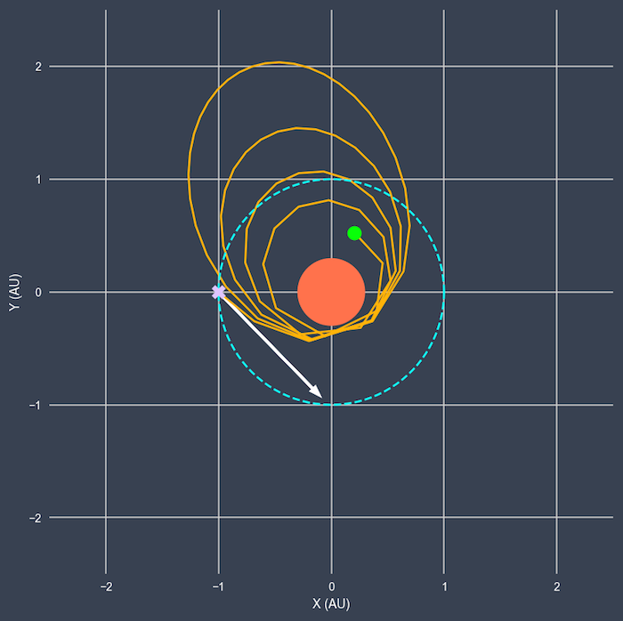

##### This notebook sets up and runs a simple orbital simulation in 2D using a Runge-Kutta 4th Order integration scheme with adaptive timestepping. The simulation assumes an inertial Cartesian coordinate system with a solar mass object at the origin and massless test particle placed on the negative-x axis (horizontal axis). Here is some brief info of what you can do:

* The initial conditions defined in ```orb_plot``` can be adjusted in real time under  **Simulation Viewer** .
* The position and velocity are tabulated and saved in real time in a dat file named ```orb.dat``` in the same directory as this notebook and can be viewed in **Taking a look at the data**. A few diagnostic plots are generated from the data as well.
* A movie of the evolution of the orbit can also be made under **Movie Maker**.

Happy Coding!


